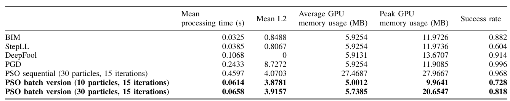

# On the Performance Benefits of Zeroth Order Methods in the Context of Adversarial Training
### *Alice Biryukov, Nicolas Dutly and Xuanchi Ren*
This repository contains our project code for the [Optimization for Machine Learning - CS-439](https://github.com/epfml/OptML_course) course @ EPFL.

### Goal of this project

Benchmark our batch particle swarm optimization (PSO) algorithm in the context of adversarial attacks / adversarial training, comparing it with to a set of reference whitebox attacks.

**The main question:** Whether zeroth order optimization (such as PSO) methods bring any benefits in terms of speed or GPU memory consuption in the context of adverserial training / attacks as they do not rely on computational graphs and gradients like many classical whitebox attacks do.

**Why do we care:** adverserial attacks can be used in a benign way to augment existing datasets with new adverserial data. In this context speed and GPU memory consumption are relevant factors which can have a large impact on practical limitations and adversarial image generation rates.

### Requirements and reproducability (important)
This project has the following dependencies (install via anaconda / pip):

    pytorch 1.4
    torchattacks 1.4
    matplotlib

To install these requirements using [anaconda](https://www.anaconda.com/products/individual) and `pip`, run:

    conda create -n optmlproj python=3.7 pytorch=1.4 matplotlib
    conda activate optmlproj
    pip install torchattacks==1.4

Furthermore, to reproduce the metrics this code needs to be run on a CUDA enabled platform. (We use the `torch.cuda` interface to accurately measure timing and memory). While the attacks are device agnostic, some metrics will not be displayed on a CPU only system. The following configuration was used to get the metrics shown in the report:

#### Reproducing results
There are two options:
1) Use the pretrained model included in this repository and the ~500 images which were correctly classified which are also included in this repository:

To do so, the archive data.7z (in `confident_input/CIFAR_model`) NEEDS to be -uncompressed- resulting in the following directory structure:

    confident_input/CIFAR_model/
			im_0_4.data
			im_1_1.data
			...
1) Retrain and regenerate new data based on the newly trained model: Run `model_trainer.py` (can take a long time!)

*Note that even with fixed seeds pytorch does not fully guarantee complete result reproduction as noted [here](https://pytorch.org/docs/stable/notes/randomness.html)*

### Repository and file structure

This section briefly covers the important files in this repository as well as their usage.

*To recreate the results:*

- `benchmark_pso.py` Run this to recreate the batch PSO performance metrics. To recreate the sequential PSO metrics follow the instructions in the file header.
- `benchmark_reference_whitebox_attacks.py` Run this to recreate the reference whitebox metrics.

*To recreate the performance figures*

- `create_memory_graphs.py` Run this to create the graph which displays memory consumption vs number of particles in the batch PSO implementation
- -`create_success_graphs.py` Run this to create the graph which displays the success rate vs particle count in the batch PSO implementation
- `create_timing_graphs.py` Run this to create the graph which displays the time required for various number of particles in the sequential and batch PSO implementations.

*Algorithms we implemented (used by the file above, not directly runnable)*

- `PSO.py` A batch GPU enabled implementation of the particle swarm algorithm
- `PSO_sequential.py` A *classical* PSO implementation

*Files used to create the CIFAR model which will be attacked in the benchmark*

- `model_trainer.py` Trains a simple CNN on the CIFAR-10 dataset, saves the model state to `models/` and ~500 correctly classified inputs to `confident_input/CIFAR_model/` (these images will then be used in the attacks)
- `models.py` Contains the definition of the model trained in the file above.

*The other file are mainly helpers used by other files, seeds are fixed in `setup_logger.py` which is imported by every other file*

### Some examples

